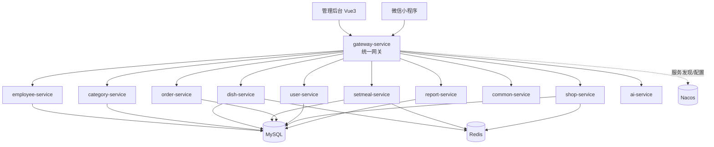

<p align="center">
  
  
  
  
  
</p>

<h1 align="center">Punctual Life Platform</h1>

<p align="center">
  准时达生活平台，一个基于 Spring Cloud 微服务架构的外卖点餐系统。
</p>

<p align="center">
  管理后台 · 微信小程序 · 微服务网关 · 服务注册发现 · Redis 缓存 · 业务报表 · 数据分析
</p>

---

## 项目简介

Punctual Life Platform（准时达生活平台）是一套前后端分离的外卖点餐平台，项目包含管理后台、微信小程序客户端以及后端微服务集群。

系统后端采用 Maven 多模块 + Spring Cloud 微服务架构，使用 Gateway 作为统一入口，Nacos 作为服务注册与配置中心，Redis 用于缓存，MySQL 用于业务数据存储。

该项目适合作为 Java 微服务、外卖业务系统、前后端分离项目、Spring Cloud Alibaba 实战项目的学习与二次开发基础。

---

## 核心功能

### 管理后台

- 员工登录、员工管理、密码修改
- 菜品分类、套餐分类管理
- 菜品管理、菜品口味管理、起售/停售
- 套餐管理、套餐菜品关联、起售/停售
- 订单管理、接单、拒单、派送、完成、取消
- 店铺营业状态管理
- 营业数据统计、订单统计、用户统计、销量排行
- Excel 报表导出
- 业务数据分析

### 微信小程序端

- 微信授权登录
- 用户地址簿管理
- 菜品、套餐浏览
- 购物车管理
- 下单、支付、取消订单
- 历史订单、订单详情、再来一单
- 催单提醒

### 平台能力

- Spring Cloud Gateway 统一网关
- JWT 双端认证体系
- Nacos 服务注册发现与配置管理
- OpenFeign 微服务远程调用
- Redis 缓存菜品、套餐、店铺状态等数据
- WebSocket 订单消息推送
- 阿里云 OSS 文件上传
- Apache POI Excel 报表导出
- 基于规则的经营数据分析

---

## 技术栈

### 后端

| 技术 | 版本/说明 |
|---|---|
| Java | 17 |
| Spring Boot | 2.7.3 |
| Spring Cloud | 2021.0.3 |
| Spring Cloud Alibaba | 2021.0.4.0 |
| Spring Cloud Gateway | API 网关 |
| OpenFeign | 服务间调用 |
| Nacos | 服务注册发现、配置中心 |
| MyBatis | 持久层框架 |
| PageHelper | 分页插件 |
| Druid | 数据库连接池 |
| Redis | 缓存 |
| MySQL | 业务数据库 |
| JJWT | JWT 认证 |
| Knife4j | API 文档 |
| Apache POI | Excel 导出 |
| WebSocket | 实时通知 |
| Aliyun OSS | 文件存储 |

### 前端

| 项目 | 技术 |
|---|---|
| 管理后台 | Vue 3、Vite、Pinia、Vue Router、Element Plus、Axios、Sass |
| 小程序端 | 微信小程序原生开发 |

---

## 系统架构



---

## 模块说明

| 模块 | 说明 |
|---|---|
| gateway-service | API 网关，负责统一入口、JWT 鉴权、动态路由 |
| sky-pojo | 公共实体、DTO、VO 对象 |
| takeout-common | 公共工具类、上下文、拦截器、异常、配置 |
| takeout-api | OpenFeign 远程调用接口 |
| employee-service | 员工与管理员服务 |
| category-service | 菜品/套餐分类服务 |
| dish-service | 菜品服务 |
| setmeal-service | 套餐服务 |
| order-service | 订单服务 |
| shop-service | 店铺状态与购物车服务 |
| user-service | 微信用户与地址簿服务 |
| common-service | 公共上传服务，集成阿里云 OSS |
| report-service | 营业报表与工作台数据服务 |
| ai-service | 经营数据分析服务 |
| sky-takeout-admin | 管理后台前端项目 |
| sky-takeout-miniapp | 微信小程序项目 |
| demo | 示例模块 |

---

## 服务端口

| 服务 | 端口 |
|---|---:|
| gateway-service | 8080 |
| category-service | 8081 |
| dish-service | 8082 |
| setmeal-service | 8083 |
| order-service | 8084 |
| user-service | 8085 |
| employee-service | 8086 |
| shop-service | 8087 |
| common-service | 8088 |
| ai-service | 8089 |
| report-service | 8090 |

---

## 项目结构

```text
Punctual_Life_Platform
├── pom.xml                    # Maven 父工程
├── README.md                  # 项目说明文档
├── gateway-service            # 网关服务
├── sky-pojo                   # 公共实体模块
├── takeout-common             # 公共工具模块
├── takeout-api                # Feign 接口模块
├── employee-service           # 员工服务
├── category-service           # 分类服务
├── dish-service               # 菜品服务
├── setmeal-service            # 套餐服务
├── order-service              # 订单服务
├── shop-service               # 店铺与购物车服务
├── user-service               # 用户服务
├── common-service             # 公共文件服务
├── report-service             # 报表服务
├── ai-service                 # 数据分析服务
├── demo                       # 示例模块
├── sky-takeout-admin          # 管理后台前端
└── sky-takeout-miniapp        # 微信小程序端
```

---

## 快速开始

### 环境要求

| 环境 | 建议版本 |
|---|---|
| JDK | 17 |
| Maven | 3.8+ |
| MySQL | 8.x |
| Redis | 6.x / 7.x |
| Nacos | 2.x |
| Node.js | 18+ |

### 1. 克隆项目

```bash
git clone <repository-url>
cd Punctual_Life_Platform
```

### 2. 准备基础服务

启动并配置以下基础组件：

- MySQL：创建业务数据库 `sky_take_out`
- Redis：用于缓存菜品、套餐、店铺状态等数据
- Nacos：用于服务注册发现与配置管理

请根据本地环境修改各服务中的配置文件或 Nacos 配置项。

### 3. 启动后端服务

先在根目录编译所有后端模块：

```bash
mvn clean package -DskipTests
```

推荐启动顺序：

```text
1. Nacos / MySQL / Redis
2. gateway-service
3. employee-service / category-service / dish-service / setmeal-service
4. user-service / shop-service / order-service / common-service
5. report-service / ai-service
```

也可以在 IDE 中分别运行各模块的 Spring Boot 启动类。

### 4. 启动管理后台

```bash
cd sky-takeout-admin
npm install
npm run dev
```

### 5. 启动微信小程序

使用微信开发者工具导入：

```text
sky-takeout-miniapp
```

根据本地网关地址调整小程序请求基础路径。

---

## 配置说明

项目采用多层配置结构：

```text
bootstrap.yml / bootstrap.yaml     # Nacos 配置中心相关配置
application.yml / application.yaml # 服务名、端口、基础配置
application-dev.yml                # 开发环境配置
```

常见需要修改的配置包括：

- MySQL 连接地址、用户名、密码
- Redis 地址、端口、数据库编号
- Nacos 地址、命名空间、分组
- JWT 密钥与过期时间
- 微信小程序 AppID / Secret
- 微信支付商户配置
- 阿里云 OSS AccessKey、Bucket、Endpoint

请勿将真实密钥、私钥、数据库密码等敏感信息提交到公开仓库。

---

## API 文档

项目集成 Knife4j，可在服务启动后访问对应服务的 API 文档页面。

常见访问方式：

```text
http://<gateway-host>:8080/doc.html
http://<service-host>:<service-port>/doc.html
```

具体是否可通过网关访问，取决于网关路由配置。

---

## 认证流程

系统分为管理端和用户端两套 JWT 认证：

| 端 | 登录接口 | Token Header | Claim |
|---|---|---|---|
| 管理端 | `/admin/employee/login` | `adminToken` | `empId` |
| 用户端 | `/user/user/login` | `userToken` | `userId` |

认证链路：

```text
用户登录
  -> 服务签发 JWT
  -> 客户端携带 Token 请求网关
  -> Gateway 校验 Token
  -> 写入 admin-info / user-info 请求头
  -> 服务拦截器提取身份
  -> BaseContext 保存当前用户 ID
```

---

## 缓存设计

| 缓存对象 | 缓存方式 | 说明 |
|---|---|---|
| 菜品列表 | Redis Key：`dish_{categoryId}` | 按分类缓存，菜品变更时清理 |
| 套餐列表 | Spring Cache | 套餐变更时清理 |
| 店铺状态 | Redis Key | 管理端设置，用户端读取 |
| 登录状态 | JWT 自包含 | 服务端不保存 Session |

---

## 业务亮点

- 微服务拆分清晰，业务边界明确
- 网关统一鉴权，服务内部无需重复校验 Token
- 使用 ThreadLocal 保存当前请求用户上下文
- 通过 AOP 自动填充创建时间、更新时间、创建人、更新人
- 使用 Redis 提升高频查询接口性能
- 基于 OpenFeign 实现服务间解耦调用
- 支持工作台数据、营业额、订单、用户、销量等多维报表
- 支持 Excel 数据导出
- 内置规则化经营分析服务，可输出趋势、风险与建议

---

## 开发建议

- 后端建议使用 IntelliJ IDEA 导入根目录 Maven 工程
- 前端建议使用 VS Code 打开 `sky-takeout-admin`
- 修改配置前先确认本地 Nacos、Redis、MySQL 已正常启动
- 公开仓库中不要提交真实数据库地址、账号密码、JWT 密钥、微信支付证书等敏感信息
- 若部署到服务器，建议将配置迁移到 Nacos 或环境变量中统一管理

---

## License

当前项目未指定开源许可证。如需开源发布，请根据实际情况补充 `LICENSE` 文件。
