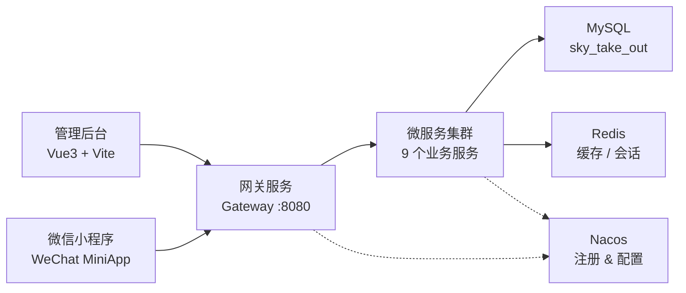
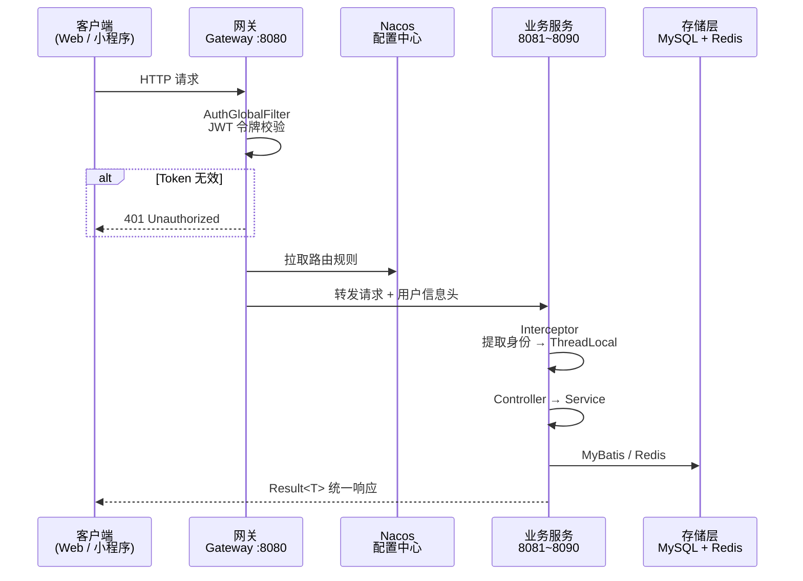
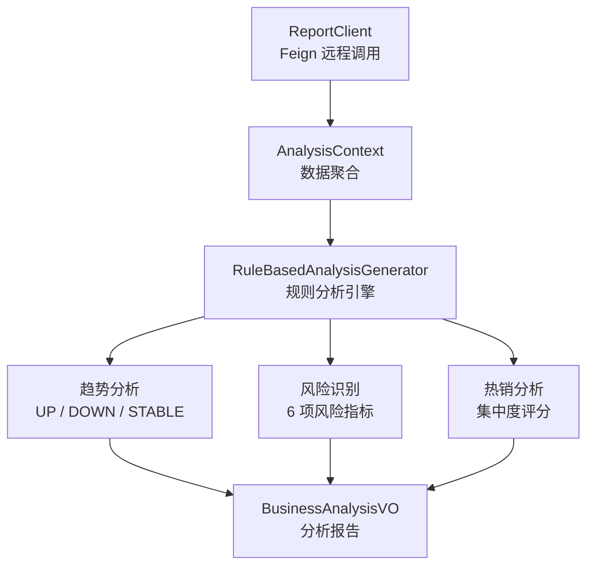
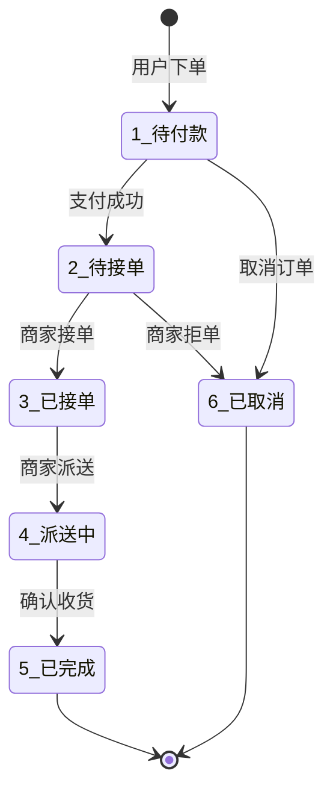
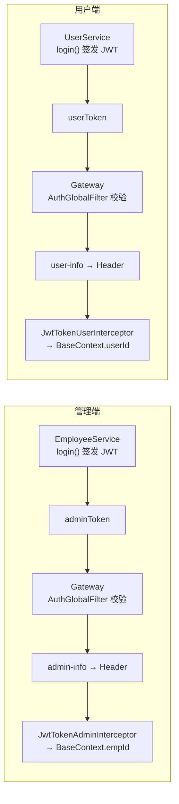
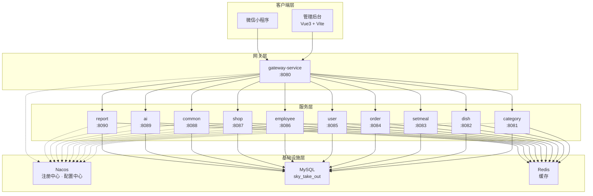

<p align="center">
  
  
  
  
  
  
  
  
</p>

<br />

<h1 align="center">  Punctual Life Platform</h1>
<h3 align="center">准时达生活平台 · 技术说明文档</h3>

<p align="center">
  <b>基于 Spring Cloud 微服务架构的外卖点餐平台</b><br />
  管理后台（Vue3） · 微信小程序 · 微服务集群 · Nacos 服务治理
</p>

<br />

---

##  目录

| 章节 | 内容 |
|:---:|---|
| 1 | [项目概述](#1-项目概述) |
| 2 | [技术栈](#2-技术栈) |
| 3 | [系统架构](#3-系统架构) |
| 4 | [核心模块详解](#4-核心模块详解) |
| 5 | [数据库设计](#5-数据库设计) |
| 6 | [缓存策略](#6-缓存策略) |
| 7 | [JWT 认证体系](#7-jwt-认证体系) |
| 8 | [部署架构](#8-部署架构) |
| 9 | [关键技术决策](#9-关键技术决策) |
| 10 | [项目文件结构](#10-项目文件结构) |

---

## 1. 项目概述

> 准时达生活平台是一套完整的 **外卖点餐 SaaS 解决方案**，涵盖管理端与用户端两大业务线。

| 属性 | 值 |
|---|---|
| **项目名称** | `sky-take-out2` |
| **Group ID** | `com.sky` |
| **版本号** | `1.0-SNAPSHOT` |
| **Java 版本** | `17` |
| **构建工具** | Maven（多模块） |
| **模块数量** | 14 个子模块 |
| **前端** | Vue3 + Vite（管理后台） / 微信小程序（客户端） |



---

## 2. 技术栈

### 2.1 后端核心框架

| 技术 | 版本 | 说明 |
|:---|:---:|---|
| **Spring Boot** | `2.7.3` | 应用基础脚手架 |
| **Spring Cloud** | `2021.0.3` | 微服务治理套件（Gateway · OpenFeign · LoadBalancer） |
| **Spring Cloud Alibaba** | `2021.0.4.0` | Nacos 服务注册发现 + 配置中心 |
| **MyBatis** | `2.2.0` | ORM 持久层框架 |
| **Druid** | `1.2.1` | 阿里巴巴数据库连接池 |
| **PageHelper** | `1.3.0` | MyBatis 物理分页插件 |
| **Knife4j** | `3.0.2` | Swagger 增强 API 文档 |

### 2.2 中间件

| 组件 | 默认地址 | 用途 |
|:---|:---:|---|
| **Nacos** | `<nacos-host>:8848` | 服务注册发现 · 配置管理 · 动态路由 |
| **Redis** | `<redis-host>:6379` | 分布式缓存 · 会话存储 |
| **MySQL** | `<db-host>:3306` | 关系型数据库（`sky_take_out`） |

### 2.3 第三方能力

| 能力 | 技术方案 | 版本 |
|:---|:---|---:|
| 文件存储 | 阿里云 OSS | `aliyun-oss-spring-boot-starter` |
| 微信登录 | 小程序 `code2session` | — |
| 微信支付 | `wechatpay-apache-httpclient` | `0.4.8` |
| JWT 鉴权 | `JJWT` (HS256) | `0.9.1` |
| Excel 报表 | `Apache POI` | `3.16` |
| 实时推送 | `WebSocket` | — |
| AOP 审计 | `AspectJ` | — |

### 2.4 前端技术

| 端 | 技术栈 | 端口 |
|:---|---:|:---:|
|  管理后台 | `Vue.js 3` + `Vite` | — |
|  客户端 | 微信小程序原生 | — |

---

## 3. 系统架构

### 3.1 模块全景图

```
punctual-life-platform
├──   gateway-service        API 网关（鉴权 · 动态路由 · 请求转发）
├──   sky-pojo               共享实体（Entity · DTO · VO）
├──   takeout-common         公共工具（拦截器 · 上下文 · OSS · 微信 · 异常）
├──   takeout-api            Feign 远程调用接口声明
│
├──   common-service         文件上传（阿里云 OSS）
├──   employee-service       员工管理（登录 · CRUD · 权限）
├──   category-service       分类管理（菜品/套餐分类 · 启停）
├──   dish-service           菜品管理（菜品 · 口味 · 缓存）
├──   setmeal-service        套餐管理（套餐 · 菜品关联 · 缓存）
├──   order-service          订单核心（下单 · 支付 · 统计 · WebSocket）
├──   shop-service           店铺状态 + 购物车
├──   user-service           微信用户 + 地址簿
├──   report-service         报表统计 + Excel 导出
├──   ai-service            业务数据智能分析
│
├──   demo/                  示例模块（3 个 Demo）
├──   sky-takeout-admin/     管理后台前端
└──   sky-takeout-miniapp/   微信小程序前端
```

### 3.2 服务注册表

| 服务 | 端口 | Nacos 注册名 | 职责关键词 |
|:---|:---:|:---|---|
| `gateway-service` | `8080` | `gateway-service` | 入口 · 鉴权 · 路由 |
| `category-service` | `8081` | `category-service` | 分类管理 |
| `dish-service` | `8082` | `dish-service` | 菜品管理 |
| `setmeal-service` | `8083` | `setmeal-service` | 套餐管理 |
| `order-service` | `8084` | `order-service` | 订单核心 |
| `user-service` | `8085` | `user-service` | 用户服务 |
| `employee-service` | `8086` | `employee-service` | 员工管理 |
| `shop-service` | `8087` | `shop-service` | 店铺 · 购物车 |
| `common-service` | `8088` | `common-service` | 文件上传 |
| `ai-service` | `8089` | `ai-service` | AI 分析 |
| `report-service` | `8090` | `report-service` | 报表统计 |

### 3.3 请求链路



### 3.4 配置分层

每个服务采用 **Bootstrap → Application → Profile** 三级配置模型：

| 层级 | 文件 | 内容 |
|:---:|:---|---|
| **1** | `bootstrap.yml` | Nacos 地址 · 共享配置 `shared-jdbc.yaml` · `shared-redis.yaml` · `shared-logback.yaml` |
| **2** | `application.yml` | 服务名 · 端口 · Knife4j 路径匹配 |
| **3** | `application-dev.yml` | 数据源参数 · Redis 连接 · JWT 密钥 · 微信配置 |

>   **设计意图** — 将 JDBC、Redis、日志等跨服务公共配置抽离到 Nacos 共享，避免在多服务间重复维护。

---

## 4. 核心模块详解

### 4.1  网关服务 `gateway-service`

> 系统唯一流量入口，基于 **Spring Cloud Gateway** Reactive 模型构建。

| 核心组件 | 职责 |
|:---|:---|
| `AuthGlobalFilter` | 全局鉴权过滤器（Order=0），白名单放行，其余校验 JWT |
| `DynamicRouteLoader` | 监听 Nacos `gateway-routes.json`，运行时热更新路由 |
| `JwtUtil` | HS256 对称加密，管理端/用户端两套密钥 |

**鉴权白名单**：
- `/admin/employee/login`
- `/admin/employee/logout`
- `/user/user/login`

```
请求进入 → 匹配白名单？
              ├─ 是 → 直接放行
              └─ 否 → 提取 adminToken / userToken
                         ├─ 校验通过 → 写入 Header (admin-info / user-info) → 放行
                         └─ 校验失败 → 401
```

### 4.2  公共模块 `takeout-common`

所有微服务的共享地基，通过 Maven `dependency` 引入。

| 核心类 | 说明 |
|:---|---|
| `Result<T>` | 统一 API 响应：`code`（1=成功/0=失败）· `msg` · `data` |
| `PageResult` | 分页响应：`total` · `records` |
| `BaseContext` | `ThreadLocal<Long>` 存储当前请求的用户/员工 ID |
| `JwtTokenAdminInterceptor` | 从请求头提取 `admin-info` → 写入 `BaseContext` |
| `JwtTokenUserInterceptor` | 从请求头提取 `user-info` → 写入 `BaseContext` |
| `AutoFillAspect` | `@AutoFill` AOP 切面，自动填充审计字段 |
| `JacksonObjectMapper` | 统一日期序列化格式 |
| `AliOssUtil` | 阿里云 OSS 上传工具 |
| `WeChatPayUtil` | 微信支付工具 |

**业务异常类**：`AccountLockedException` · `AccountNotFoundException` · `PasswordErrorException` · `ShoppingCartBusinessException` · `OrderBusinessException` · `LoginFailedException`

### 4.3  远程调用模块 `takeout-api`

基于 **OpenFeign** 的声明式接口，配合 `DefaultFeignConfig`（FULL 日志 + `RequestInterceptor` 传递用户上下文）。

| Feign 接口 | 目标服务 | 核心能力 |
|:---|---|:---|
| `DishClient` | `dish-service` | 按 ID / 状态查询菜品 |
| `SetmealClient` | `setmeal-service` | 按菜品 / ID / 状态查询套餐 |
| `OrderClient` | `order-service` | 订单统计 · 营业额 · 销量 Top10 |
| `UserClient` | `user-service` | 用户查询 · 地址簿 · 用户统计 |
| `ReportClient` | `report-service` | 营业数据 · 各类报表 · Top10 |
| `ShopClient` | `shop-service` | 购物车列表 · 清空购物车 |
| `CategoryClient` | `category-service` | 分类查询 |
| `EmployeeClient` | `employee-service` | 员工查询 |

### 4.4 业务服务矩阵

| 服务 | 管理端接口 | 用户端接口 | 特色能力 |
|:---|:---|:---|:---|
| **employee-service** | `/admin/employee/**` | — | 登录 · CRUD · 状态启停 · 密码修改 |
| **category-service** | `/admin/category/**` | `/user/category/**` | 分类管理 · 双端接口 |
| **dish-service** | `/admin/dish/**` | `/user/dish/**` | 菜品管理 · 口味管理 · Redis 缓存 |
| **setmeal-service** | `/admin/setmeal/**` | `/user/setmeal/**` | 套餐管理 · Spring Cache |
| **order-service** | `/admin/order/**` | `/user/order/**` | 订单全生命周期 · 统计 · WebSocket |
| **shop-service** | `/admin/shop/**` | `/user/shop/**` · `/user/shoppingCart/**` | 店铺状态 · 购物车 |
| **user-service** | — | `/user/user/**` · `/user/addressBook/**` | 微信登录 · 地址簿 · 统计 |
| **report-service** | `/admin/report/**` · `/admin/workspace/**` | — | 报表 · Excel 导出 · 工作台 |
| **common-service** | `/admin/common/**` | — | 阿里云 OSS 文件上传 |

### 4.5  AI 分析服务 `ai-service`

> 基于**规则引擎**的业务数据分析（非大模型调用）



**分析维度**：

| 维度 | 方式 | 判定逻辑 |
|:---|:---|---|
| **趋势** | 前后半段均值对比 | 增长 → UP · 下降 → DOWN · 持平 → STABLE |
| **风险** | 6 项指标检测 | 零订单 · 低完成率 · 低新用户 · 营业额下滑 · 低客单价 · 高集中度 |
| **热销** | 集中度计算 | Top1 ≥ 50%：高 · Top3 ≥ 70%：中 · 其余：低 |

支持 **DAY / WEEK / MONTH** 三种时间维度，范围分析最长 **31 天**。

---

## 5. 数据库设计

> 数据库：`sky_take_out`

### 核心业务表

| 表名 | 说明 | 关键字段 |
|:---|:---|:---|
| `employee` | 员工表 | `id` · `username` · `password`(MD5) · `status` |
| `category` | 分类表 | `id` · `type`(1菜品/2套餐) · `name` · `sort` · `status` |
| `dish` | 菜品表 | `id` · `category_id` · `name` · `price` · `image` · `status` |
| `dish_flavor` | 口味表 | `id` · `dish_id` · `name` · `value` |
| `setmeal` | 套餐表 | `id` · `category_id` · `name` · `price` · `status` |
| `setmeal_dish` | 套餐-菜品关联 | `id` · `setmeal_id` · `dish_id` · `copies` |
| `orders` | 订单表 | `id` · `number` · `status`(1~6) · `user_id` · `amount` |
| `order_detail` | 订单明细 | `id` · `order_id` · `dish_id` · `setmeal_id` · `amount` |
| `shopping_cart` | 购物车 | `id` · `user_id` · `dish_id` · `setmeal_id` · `number` |
| `user` | 微信用户 | `id` · `openid` · `name` · `phone` · `avatar` |
| `address_book` | 地址簿 | `id` · `user_id` · `consignee` · `is_default` |

### 订单状态机



---

## 6. 缓存策略

| 数据 | 缓存 Key / 注解 | 失效策略 |
|:---|:---|:---|
| 菜品列表 | `dish_{categoryId}` | 菜品增删改时手动 `redisTemplate.delete()` |
| 套餐列表 | `@Cacheable("setmealCache")` | `@CacheEvict` 在写操作时触发 |
| 店铺状态 | `SHOP_STATUS` | 直接读写，设过期时间 |
| 用户 Token | JJWT 自包含 | 2 小时自然过期，无需服务端存储 |

>   **旁路缓存模式** — 读：缓存命中返回，未命中查 DB 并回填；写：先更新 DB，再删除缓存。

---

## 7. JWT 认证体系

系统维护 **管理端** 与 **用户端** 两套独立认证链路：

| 属性 |  管理端 |  用户端 |
|:---|:---|:---|
| **签发服务** | `employee-service` | `user-service` |
| **校验位置** | `gateway-service` | `gateway-service` |
| **密钥** | `itcast` | `itheima` |
| **有效期** | `7200000ms` (2h) | `7200000ms` (2h) |
| **请求头** | `adminToken` | `userToken` |
| **Claim** | `empId` | `userId` |
| **传递方式** | `admin-info` Header | `user-info` Header |



---

## 8. 部署架构

### 拓扑图



### 启动顺序

| 步骤 | 组件 | 说明 |
|:---:|:---|:---|
| **1** | Nacos Server | 注册中心 + 配置中心，需最先启动 |
| **2** | MySQL + Redis | 存储层就绪 |
| **3** | `gateway-service` | 网关先行，避免服务暴露 |
| **4** | 9 个业务服务 | 无严格依赖，可并行启动 |
| **5** | 前端应用 | 管理后台 + 微信小程序 |

---

## 9. 关键技术决策

| # | 决策 | 理由 |
|:---:|:---|:---|
| 1 | **JWT 无状态认证** | Token 自包含用户信息，网关统一校验，避免服务端 Session 存储，水平扩展友好 |
| 2 | **Nacos 动态路由** | `gateway-routes.json` 存储于 Nacos，运行时热更新，无需重启网关 |
| 3 | **AOP 自动审计** | `@AutoFill` 注解 + `AutoFillAspect` 切面，在 Mapper 执行时自动注入 `createTime`/`updateTime`/`createUser`/`updateUser` |
| 4 | **ThreadLocal 上下文传递** | 网关写入 Header → 拦截器提取 → `BaseContext` ThreadLocal，全链路可获取用户身份 |
| 5 | **旁路缓存模式** | 写操作删缓存、读操作查缓存未命中回填，避免数据不一致 |
| 6 | **Feign 全日志** | `DefaultFeignConfig` 配置 FULL 级别，便于开发阶段排查跨服务调用问题 |
| 7 | **MD5 密码存储** | `DigestUtils.md5DigestAsHex()` 对员工密码进行哈希存储 |

---

## 10. 项目文件结构

```
Punctual_Life_Platform/
├── pom.xml                     父 POM（多模块依赖与插件管理）
├── README.md                   项目技术说明文档
├── docs/                       文档目录
│
├──   gateway-service/          网关服务（入口 · 鉴权 · 动态路由）
├──   sky-pojo/                 共享实体（Entity · DTO · VO）
├──   takeout-common/           公共工具（拦截器 · 上下文 · OSS · 微信 · 异常）
├──   takeout-api/             Feign 远程调用接口声明
│
├──   common-service/           文件上传（阿里云 OSS）
├──   employee-service/         员工管理
├──   category-service/         分类管理
├──   dish-service/             菜品管理
├──   setmeal-service/          套餐管理
├──   order-service/            订单核心
├──   shop-service/             店铺状态 + 购物车
├──   user-service/             微信用户 + 地址簿
├──   report-service/           报表统计 + Excel 导出
├──   ai-service/              AI 业务分析
│
├──   demo/                     示例模块（3 个子 Demo）
├──   sky-takeout-admin/        管理后台前端（Vue3 + Vite）
└──   sky-takeout-miniapp/      微信小程序前端
```

---

<p align="center">
  <sub>Built with  Spring Cloud · Nacos · Redis · MySQL · Vue3 · WeChat Mini Program</sub>
</p>